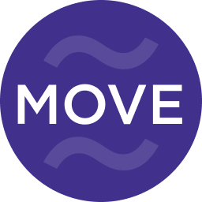

# Introduction

Many crypto-developers are also interested in using the Move language. The reasons for this are its high security and the emerging markets that will grow as soon as cryptographic and non-cryptographic users are united.

We will lean on the prior developments and expertise of the Dfinance team, who were the first to integrate the Move VM into existing blockchains when working on the [Dfinance](https://dfinance.co) platform and now to Pontem.


🧙‍♂️ Move Language is the most secure smart contracts language and will probably become the de facto standard after Solidity. 


It combines security by design (__formal verification from box, atomic resource model__) with ease of use, being Turing complete, safe and flexible. It is developed and used by Facebook's Diem (formerly known as Libra), which makes the Pontem network compatible with the upcoming Diem financial network. 

While having built-in security by design such as resource-oriented architecture and formal verification, Move VM still severely lacks toolsets and documentation.

Unique features implemented in Move Language:

* **Access Control** - In Move, any custom asset can be declared as a resource type, making it safe and access-controlled by default. This feature allows for example to maintain ownership information and privileges of digital assets even within smart contracts. If an asset is sent to a smart contract, ownership is not changed. For example, if a hacker gets access to a Move smart contract, he would not be able to withdraw the assets to his own wallet unless that functionality is a feature of the smart contract.
* **Atomic resources architecture** - Prevents developers from making basic mistakes that are common in smart contracts development such as reentrance errors or double-spending errors. In Move, resources can never be copied or implicitly discarded, only moved between storage locations.
* **Modules** - Are similar to banks. Each resource is stored in an individual vault, controlled by the owner’s account. Resource operations are limited by the functions supported by the specific module, which may be called from outside the module. Developers can deploy new modules to the network.
* **Scripts** - Each transaction on the network may contain a script that can call several modules or initiate several actions. Developers can use one transaction to engage a number of actions which significantly reduces the number of smart contracts required for an application. This results in safer applications, better user experience, and significantly more flexibility.
* **Bytecode verifier** - An integral part of Move which checks new modules and scripts for security properties before these are published. Once verified, the Bytecode interpreter module executes the code. This feature reduces the number of runtime errors.
* **Formal verification** - Modules can be verified using formal verification automatically before being deployed.

As Move language is very young, there is not much information about it, this is why we are ready to present available documentation so you can learn Move language by examples and using existing books/tutorials.

List of recommended resources:

* [Move Diem Documentation](https://developers.diem.com/main/docs/move-introduction) - official Move language documentation from Diem team.
* [Move Book EN](https://move-book.com) - Move Book.
* [Move Book CN](https://move-book.com/cn/) - Move Book Chinese version.

Meanwhile in the current documentation you can find more advanced examples, tips and tricks. 

Also look at our [tutorials](../tutorials/README.md) to learn Move by examples.
